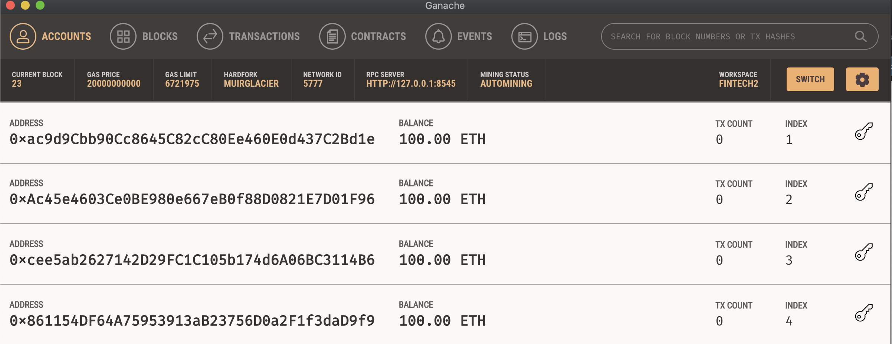
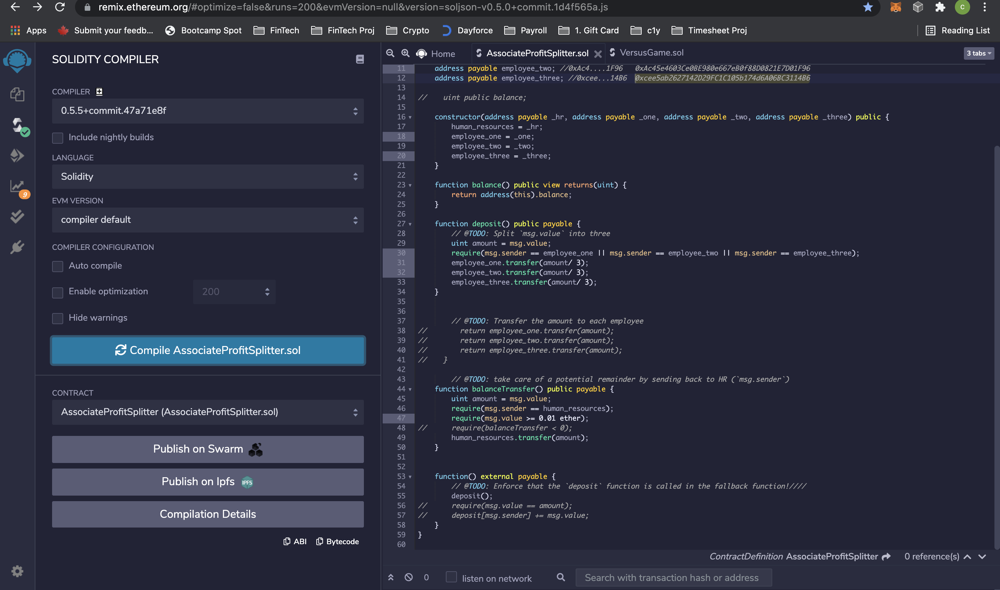
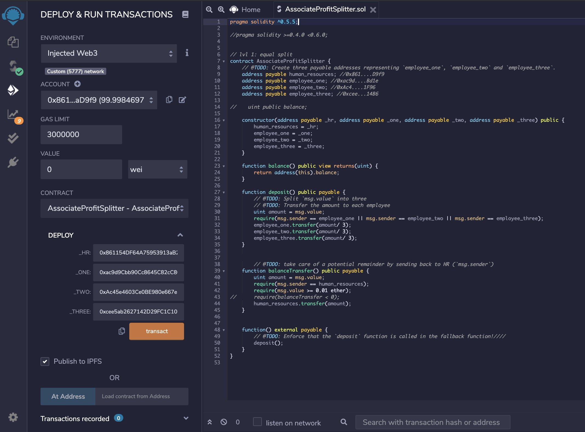
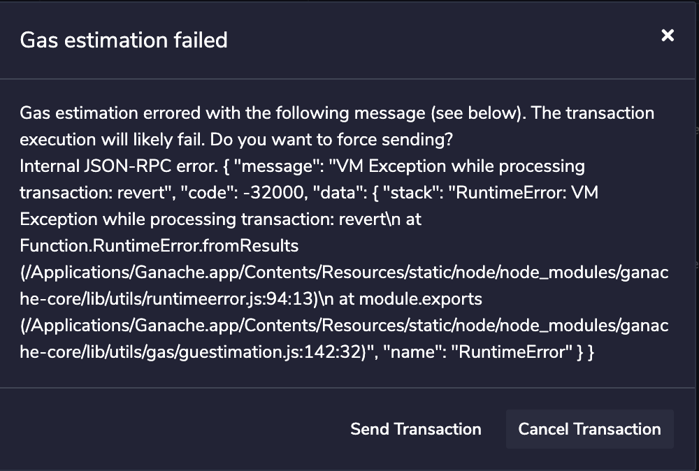
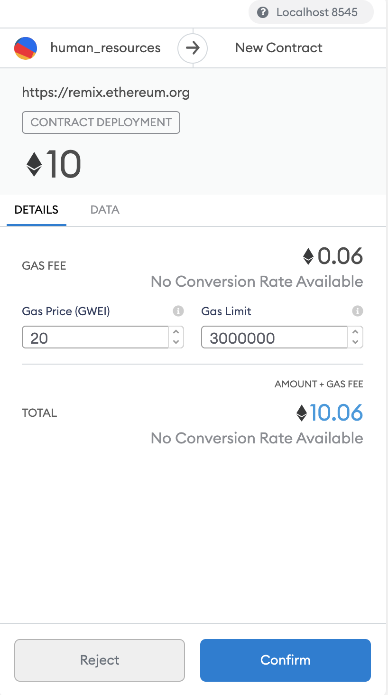
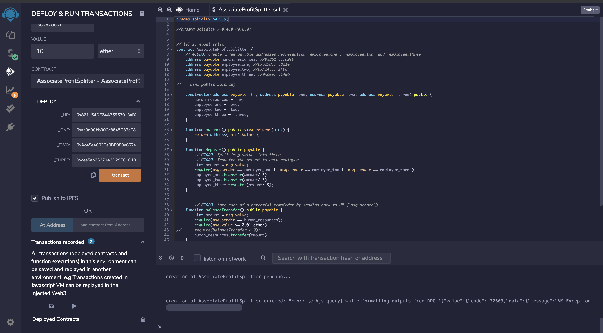
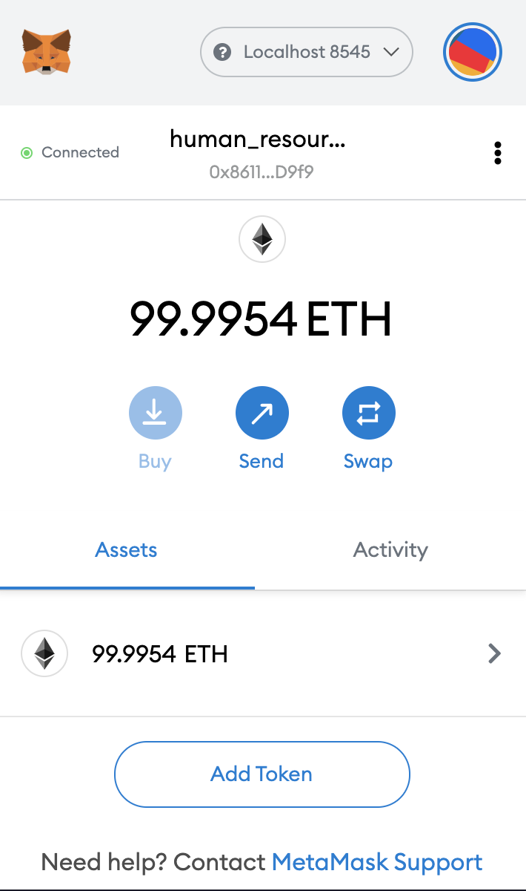

### FinTech Homework: 20_Solidity

Ganache before deploying the contract; zero TX Count.
Index 1 = employee_one
Index 2 = employee_two
Index 3 = employee_three
Index 4 = HR

---

Contract in Remix compiled without error.

---

Entered addresses of HR and 3 employees. This was a screenshot after the first trial deployment (Account balance now showed <100)

---

Error related to Gas, which I don't know to to adjust or fix.

---

Metamask automatically pulled up > Confirmed Transaction.

---
First time the contract was deployed the Deploy Tab was enabled but I forgot to take a screenshot. After refreshing Remix the succeeding times of deploying showed as "Pending..."

Metamask after deployment.

